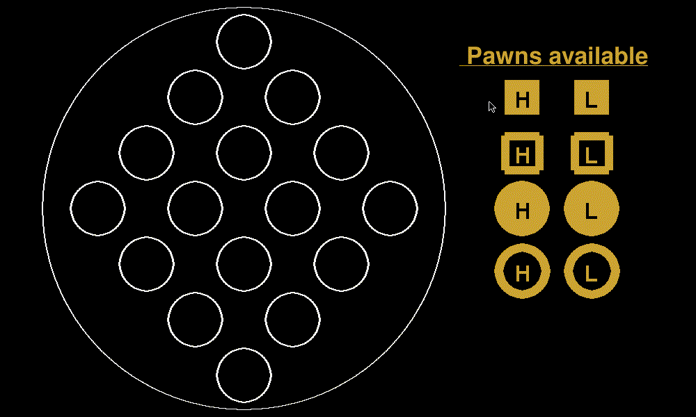

# s301514_Computational_intelligence
## Disclaimer
I declare ,for exam evaluation purposes, that this is the first time I have used python or such high-level languages in general.
My computer skills are strongest first in the hardware description side and second with low-level iteration, indeed I belong to the embedded systems track.
### The choice of this course 
I also declare that the reason for choosing this course is because the science of computational intelligence will be the new milestone of technologies in a decade,.\
Hardware architectures are increasingly orienting to support AI algorithms so a knowledge of how these algorithms work surely are  important thing if I want to become a hardware expert.
### Experience 
Im a work student and i have also DSA,so for me learing python and also CI method it wasent a nerf game. I learn a lot from the peer review and
from my collegue that are more competent then me in this field, but after the initial difficulties i was able to perform a min max for quarto.

## collaboration:
Salvatore Licata (s295798)
Maria Rosa Scoleri (s301841)

<!--_____________________________________SETTIMANA 14 __________________________________-->
## Wk 14       [ 22 Jan to 31 Jan]  
✅ full time work at MBDA\
✅  check again report and send 
<!--_____________________________________SETTIMANA 13 __________________________________-->
## Wk 13       [ 15 Jan to 21 Jan]  
✅ full time work at MBDA

<!--_____________________________________SETTIMANA 12 __________________________________-->
## Wk 12       [ 8 Jan to 14 Jan]  
✅ full time work at MBDA\
✅ Finisched Report

<!--_____________________________________SETTIMANA 11 __________________________________-->
## Wk 11       [ 1 Jan to 7 Jan]  
✅ Minmax and quarto game \
✅ finisched quarto \
✅ Report

<!--_____________________________________SETTIMANA 10 __________________________________-->
## Wk 10       [ 26 Dic to 31 Dic]  
✅ start to see quarto problem\
✅ Build a first trial of quarto min max and min max alfa beta\
✅ Performed peer issues for LAB3 to [Raffaele Pane](https://github.com/bred91/Computational_Intelligence_2022-2023/tree/main/lab3) 
<!--_____________________________________SETTIMANA 9 __________________________________-->
## Wk 9       [ 19 Dic to 25 Dic]  
❌ vacation and illness  

<!--_____________________________________SETTIMANA 8 __________________________________-->
## Wk 8      [ 12 Dic to 18 Dic]  

✅ Requested on the group for someone to evaluate my lab 2\
✅ Requested on the group for someone to evaluate my lab 3\
✅ Requested on the person who was in charge to evaluate lab 2 and 3\
✅ asked for a peer review on group \
❌ no peer reviews received for lab 3\
❌ no peer reviews received for lab 2\
❌  illness problem

<!--_____________________________________SETTIMANA 7 __________________________________-->
## Wk 7       [ 5 Dic to 11 Dic]  
✅ understand the Lab 3 problem\
✅ studied minmax \
✅ studied colleagues solution of LAB3.3\
✅ studied colleagues solution of LAB3.4\
✅ Implemented Lab3.3\
❌ found a solution for  MinMax strategy in QUARTO!
<!--_____________________________________SETTIMANA 6 __________________________________-->
## Wk 6       [ 28 Nov to 4 Dic]  
✅ understand the Lab 3 problem\
✅ studied colleagues solution of LAB3.1\
✅ studied colleagues solution of LAB3.2\
✅ Implemented Lab3.1 \
✅ Implemented Lab3.2 
<!--_____________________________________SETTIMANA 5 __________________________________-->
## Wk 5       [ 21 Nov to 27 Nov]  
  

  
  

✅ Completed the Random game of quarto: [QUARTO!]([GUI/main.py](https://github.com/jonathan2503/Computational_intelligences_301514/tree/main/Quarto_Random))\
✅ implemented win logic\
✅ AI class\
✅ AI class\
✅ Ghost class\
✅ Requested on the group for someone to evaluate my lab 2\
❌ some little Bug to be fixed   \
❌ no peer reviews received 
<!--_____________________________________SETTIMANA 4 __________________________________-->
## Wk 4       [ 14 Nov to 20 Nov]  

✅ Theory \
✅ Decided to develop anyway whith py game as optional while waiting the game instruction\
✅ Performed peer issues for LAB2 to [Raffaele Pane](https://github.com/bred91/Computational_Intelligence_2022-2023/tree/main/lab2) \
✅ Learn what  [Raffaele Pane](https://github.com/bred91/Computational_Intelligence_2022-2023/blob/main/lab2/Lab_2_upgraded.ipynb) did for improve efficency on Lab 2

<!--_____________________________________SETTIMANA 3 __________________________________-->
## Wk 3       [ 31 Ott to 6 Nov]  

### [Lab2](https://github.com/jonathan2503/Computational_intelligences_301514/tree/main/lab2)
 ❌ Try my implementation based on prof's algoritm \
 ✅ studied the implementation of colleagues \
 ✅ Implemented a simpler form of the colleagues' solution
 

### [Quarto]([GUI/main.py](https://github.com/jonathan2503/Computational_intelligences_301514/tree/main/GUI))
  ✅ clik-event real time  \
  ✅ GUI complete \
  <!--❌ STOP working on the  GUI because a server in C++  will be provided to us and  which we will interface with    -->
  

  

<!--_____________________________________SETTIMANA 2 __________________________________-->

## Wk 2        [ 24 Ott to 30 Ott]  
### [Quarto](https://github.com/jonathan2503/Computational_intelligences_301514/tree/main/GUI)
  ✅ Button \
  ✅ TableButton \
  ✅ FSM \
  ✅ Mangaed button and FSM\
  ✅ new GUI :
  

  

<!--_____________________________________SETTIMANA 1 __________________________________-->

## Wk 1        [ 17 Ott to 23 Ott]  

### [Lab1](https://github.com/jonathan2503/Computational_intelligences_301514/tree/main/lab1)
 ✅ Performed issues to [Raffaele Pane](https://github.com/bred91/Computational_Intelligence_2022-2023/tree/main/lab1) \
 ✅ Carefully analyzed the Issue of my lab1 performed by   [Marco Masera](https://github.com/Marco-Masera) \
 ✅ Relased V1 whit correction suggested, better output. \
 ✅ Closed the issue
### [Quarto](https://github.com/jonathan2503/Quarto/tree/Quarto)
  ✅ class Board \
  ✅ Board.board_set_up \
  ✅ Board.get_position \
  ✅ Board.draw_pawn \
  ✅ finished constructing the GUI :
  

  

<!--_____________________________________SETTIMANA 0 __________________________________-->
## Wk 0        [ 9 Ott to 16 Ott]  

### [Lab1](https://github.com/jonathan2503/Computational_intelligences_301514/tree/main/lab1)
 ✅ understand the problem \
 ✅  find a basic solution with colleagues \
 ✅  solution obtained \
 ✅  documentation and publication of the result \
❌ tried implement  VHDL solution  ( The data form of VHDL is not compatible whit the problem)\
❌ tried implement C++ solution   ( The data form of C++ is not compatible whit the problem)

### [Quarto](https://github.com/jonathan2503/Computational_intelligences_301514/tree/main/GUI)
  ✅ understand the game \
  ✅ define the GUI \

